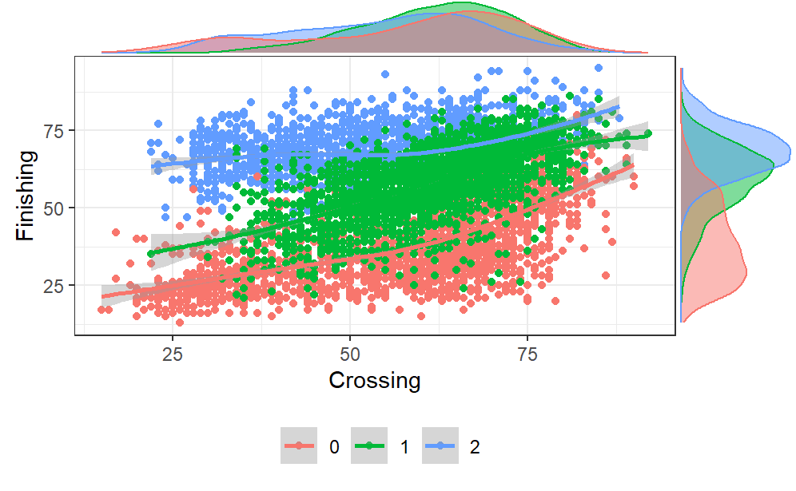
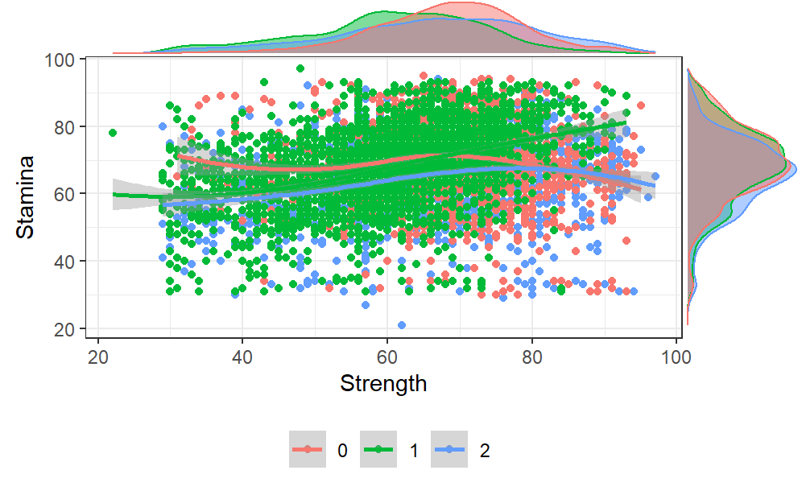
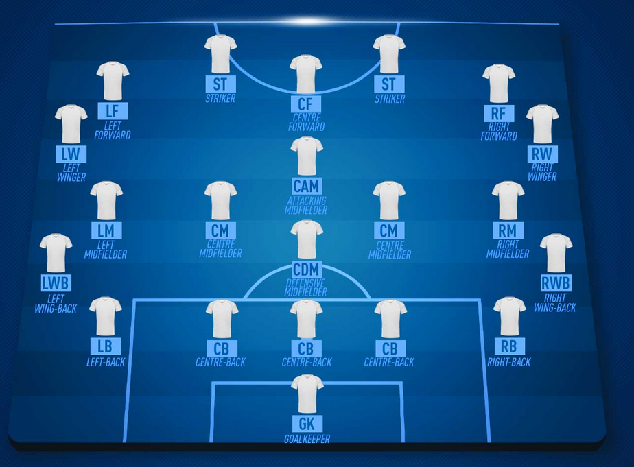
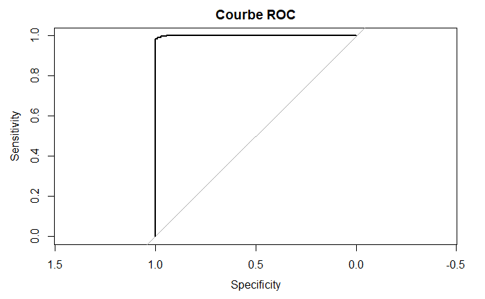
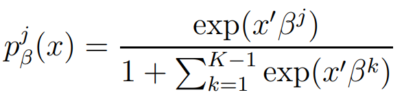
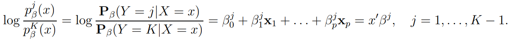
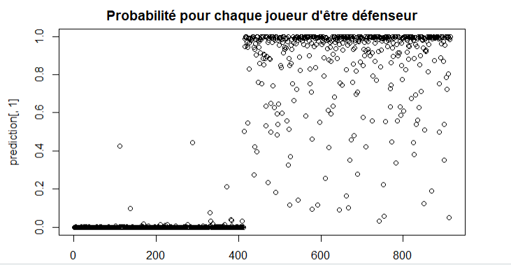

```{r setup, include=FALSE}
library(knitr)
knitr::opts_chunk$set(echo = FALSE)
#load your local directory
load("D:/Study/INSA/S8/Statistical Learnig/Projet/.RData")
#import packages if we wanted to run the r code in slides
library(caret)
library(kernlab)
library(dplyr)
library(tidyverse)
library(e1071)
library(rpart)
library(rpart.plot)
library(plotROC)
library(keras)
library("ggplot2")
library("GGally")
library("ggExtra")
library("ggalluvial")
```

## Summary

- Présentation du contexte et des données
- Première classification (modèles et comparaison)
- Deuxième classification (modèles et comparaison)
- Conclusion

## Présentation du contexte


- Certains jeunes joueurs peuvent jouer différents postes

- Objectif : conseiller le poste où il serait le meilleur (attaquant, milieu ou défenseur) 

## Méthodologie

- Utilisation des données du jeu vidéo de football Fifa 21
- Utilisation de méthodes de machine learning : régression, svm, adaboost, arbre de décision et réseaux de neurones

## Présentation des données

```{r}
colnames(players_3)
```

## Présentation des données (att)

```{r,out.width="100%"}
plt_att
```

## Présentation des données (mid)

```{r,out.width="100%"}
plt_mid
```

## Présentation des données (def)

```{r,out.width="100%"}
plt_def
```

- Classification d'abord des attaquants et défenseurs, puis des attaquants défenseurs et milieux.

## Identification de variables corrélés 

```{r,out.width="100%",out.height="100%"}
ggcorr(data = players_2[,-1],
       method = c("pairwise.complete.obs", "pearson"),
       label = FALSE, label_size = 2,size = 2)
```

## Plots conditionnels

```{r,out.width="50%"}


```


## Séparation de données 

```{r,echo=TRUE}
Attack=c("LW", "LF", "RW","RF", "CF", "ST")
Defense=c("RB", "RWB", "LB", "LWB", "CB")
Midfielder=c("CAM", "CM", "CDM", "LM", "RM")

```

## Regression logistique


```{r}

```


```{r,echo=TRUE}
#modeleRegLog = glm(Position ~ ., data = train2, family = binomial)
#summary(modeleRegLog)
```


## Linear SVM

```{r,out.height="100%"}
train.mod.lin
```

## Accuracy of linear svm

```{r, out.width = "50%"}
par(mfrow=c(1,2)) 
plot(train.mod.lin, metric = "Accuracy",xTrans=log10,main = "linear svm with criterion accuracy")
plot(train.mod.lin, metric = "Kappa",xTrans=log10,main = "linear svm with criterion kappa")
```

## Radial SVM

```{r}
train.mod.rad
```

## Accuracy of radial svm

```{r, out.width = "50%"}
par(mfrow=c(1,2)) 
plot(train.mod.rad, metric = "Accuracy",xTrans=log10,main = "radial svm with criterion accuracy")
plot(train.mod.rad, metric = "Kappa",xTrans=log10,main = "radial svm with criterion kappa")
```

## Prédiction of linear svm 

```{r}
confusionMatrix(data = prev, reference = test1$Position)
```

## Arbre de décision

```{r}
train.mod.tree
```

## Précision d'arbre de décision

```{r, out.width = "50%"}
par(mfrow=c(1,2)) 
plot(train.mod.tree, metric = "Accuracy", xTrans = log10, xlab = "log10 Cp", main = "Binary tree (Accuracy criterion)")
plot(train.mod.tree, metric = "Kappa", xTrans = log10, xlab = "log10 Cp", main = "Binary tree (Kappa criterion)")
```


## Prédicion d'arbre de décision

```{r}
confusionMatrix(pred.tree,reference =na.omit(tree_test_data)$Position)
```


## The best tree

```{r}
prp(train.mod.tree$finalModel, main = "Best binary tree")
```


## Pourquoi l'arbre de décision n'est pas coûteux en temps de calcul ?

- Les algorithmes d'arbres de décision ne calculent pas tous les arbres possibles lorsqu'ils ajustent un arbre.
- Les algorithmes d'ajustement des arbres de décision prennent généralement des décisions avides au cours du processus d'ajustement.
- Plus on s'enfonce dans l'arbre de décision, plus l'ensemble des données qui ont atteint le noeud donné est réduit, un sous-ensemble de données plus petit.  

## Ada boost

```{r,out.width="50%"}
par(mfrow=c(1,2))
plot(mod.ada, metric = "Accuracy", xlab = "M", main = "Adaboost (Accuracy)")
plot(mod.ada, metric = "Kappa", xlab = "M", main = "Adaboost (Kappa)")
```


## Prédicition

              Accuracy : 0.9941          
                 95% CI : (0.9872, 0.9978)
    No Information Rate : 0.5295          
    P-Value [Acc > NIR] : <2e-16          
                                      


## Neural network


```{r}
images_1 = c(
  "model1_neural_single.png",
  "model2_neural_single.png",
  "model3_neural_single.png"
)
images_2 = c(
  "model1_neural_two.png",
  "model2_neural_two.png",
  "model3_neural_two.png"
)
images_3 = c(
  "model1_neural_three.png",
  "model2_neural_three.png",
  "model3_neural_three.png"
)
```

## single layer

```{r, fig.cap = "Neural netwwork single layer", out.width = "33%", fig.show = "hold"}
knitr::include_graphics(images_1)
```

## two layers

```{r, fig.cap = "Neural netwwork two layer", out.width = "33%", fig.show = "hold"}
knitr::include_graphics(images_2)
```


## Comparaison (att & def)
```{r}
compar1=ggplot(data.frame(methode=c("regression", "svm (linéaire et radial)", "arbre", "adaboost", "neural network"), value=c(0.985, 0.99, 0.97,0.99, 0.993435442447662) ))+geom_col(aes(x=methode, y=value))+ggtitle("Comaraison des algorithmes \n en ayant pris uniquement les attaquants et les défenseurs")
compar1
```


## Prise en compte des milieux de terrain

Nous considérons les postes de milieux. 

## Regression Logistique

Nous utilisons la même manière précédente: 

```{r,out.height="50%",out.width="100%"}


```

## Regression Logistique

Prediction finale:

```{r}

```


## SVM

```{r}
train.svm.poly
```

## Accuracy and quality of polynomial svm

```{r, out.width = "50%"}
par(mfrow=c(1,2)) 
plot(train.svm.poly, metric = "Accuracy", xTrans = log10, xlab = "log10 Cp", main = "Polynomial svm (Accuracy criterion)")
plot(train.svm.poly, metric = "Kappa", xTrans = log10, xlab = "log10 Cp", main = "Polynomial svm (Kappa criterion)")
```

## Neural network

```{r}
#single layer
images_3_1 = c(
  "3_1_1.png",
  "3_1_2.png",
  "3_1_3.png"
)
#two layer
images_3_2 = c(
  "3_2_1.png",
  "3_2_2.png",
  "3_2_3.png"
)
#three layer
images_3_3 = c(
  "3_3_1.png",
  "3_3_2.png",
  "3_3_3.png"
)
```

## single layer

```{r, fig.cap = "Neural netwwork single layer", out.width = "33%", fig.show = "hold"}
knitr::include_graphics(images_3_1)
```

## two layers

```{r, fig.cap = "Neural netwwork two layer", out.width = "33%", fig.show = "hold"}
knitr::include_graphics(images_3_2)
```

## three layers

```{r, fig.cap = "Neural netwwork three layer", out.width = "33%", fig.show = "hold"}
knitr::include_graphics(images_3_3)
```

```{r}
images_seq = c(
  "seq24_neural.png",
  "seq25_neural.png",
  "seq26_neural.png",
  "seq27_neural.png",
  "seq28_neural.png",
  "seq33_neural.png",
  "seq38_neural.png",
  "seq39_neural.png",
  "seq42_neural.png"
)
```

## Nouveau modèle


```{r,echo=TRUE}
#model = keras_model_sequential() 
#model %>% layer_dense(units=200, activation="sigmoid", input_shape=length(x_train[1,])) 
#model %>% layer_dense(units=100, activation="relu") 
#model %>% layer_dense(units=50, activation="sigmoid") 
#model %>% layer_dense(units=25, activation="relu")
#model %>% layer_dense(units=12, activation="sigmoid")
#model %>% layer_dense(units=3, activation="softmax")
#model %>% compile(loss="sparse_categorical_crossentropy",optimizer="adam",metrics='accuracy')
#summary(model)
#history=model%>% fit(x=x_train_mid, y=y_train_mid, epochs=50, batch_size=5,validation_split=0.3)
#plot(history)
#model %>% evaluate(x_test_mid, y_test_mid)
```

## Visualisation de ce modèle

```{r,fig.cap = "modèle finale", out.height = "100%", fig.show = "hold"}

knitr::include_graphics(images_seq[7])
```

Nous obtenons une accuracy de 82%

## Comparaison (att & mid & def)
```{r}
compar2=ggplot(data.frame(methode=c("regression polytomique nominale", "regression polytomique ordonnee", "svm polynomial", "neural network"), value=c(0.77,0.79, 0.87,0.84) ))+geom_col(aes(x=methode, y=value))+ggtitle("Comaraison des algorithmes \n en ayant pris uniquement attaquants milieux et défenseurs")
compar2
```


## Conclusion 

- Machine Learning est désormais largement utilisé dans le football.

- Quel que soit la méthode utilisée, nous obtenons plus de 98% accuracy en séparant attanquants et défenseurs

- Les résultats obtenus en incluant les milieux dans l'analyse sont moins bon 

- Avec 86% d'accuracy, SVM est la méthode à privilégié pour classer attaquants, milieux et défenseurs. On obtient "seulement" 84% avec un réseau de neurones à 6 couches.

# MERCI !


