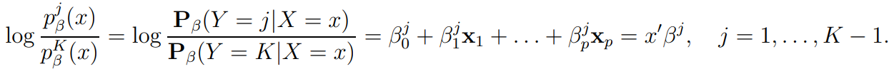
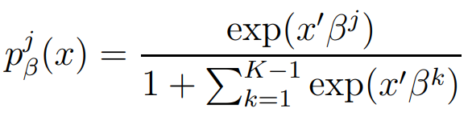

# Projet Apprentissage statistque : Classification des postes des joueurs de fotball

## I. Introduction

Le but de ce projet est de classer le poste des joueurs de football issue du dataset FIFA 2021.

```{r}
players=read.csv("FIFA.csv")
head(players)
```

Sur ce dataset, chaque joueur possède un ID, son nom, sa nationalité, une note globale, son club et des informations sur son contrat (salaire, fin du contrat), ses caractéristiques physiques (poids, taille, corpulance), sa position. Enfin, les 30 dernières colones concernent les qualités footballistiques du joueur tels que sa qualité de passe, sa vitesse, sa capacité à controler le ballon, sa vision du jeu ou ses qualités défensives. Sur chaque caractéristique, le joueur est noté sur 100.

Comme nous cherchons à prédire le poste selon les caractéristiques du joueurs, Les colonnes de ce jeu de données qui nous intéressent sont le poste ou "position" (la variable à expliquer) et les colonnes concernant les caractéristiques du joueurs. 


Il y a 4 types de positionnement au football : Gardien de but, défenseur, milieu et attaquant.
Classer les gardiens avec les autres joueurs n'a que peu d'intérêt. Ce poste est à part, les gardiens s'entraînent souvent de manière spécifique et ont un rôle très différent des autres joueurs. On écarte donc les gardiens de l'étude ainsi que les colonnes concernant les caractériqtiques spécifiques des autres joueurs.

On peut voir également qu'il y a des milieux défensifs et offensifs.  Les milieux défensifs vont avoir des qualités proches de celles des défenseurs tandis que les milieux offensifs seront plus proches des attaquants. 
Ainsi, afin d'éviter que nos modèles ne soient faussés par cette spécificités du football, nous supprimerons les milieux de l'étude et chercherons simplement à classer les joueurs entre "attaquant" et "défenseur"

```{r}
players_2=players[,c("Position","Crossing", "Finishing","Heading.Accuracy","Short.Passing", "Volleys", "Dribbling", "Curve", "FK.Accuracy","Long.Passing", "Ball.Control", "Acceleration", "Sprint.Speed","Agility","Reactions","Balance","Shot.Power","Jumping", "Stamina","Strength","Long.Shots", "Aggression", "Interceptions", "Positioning","Vision","Penalties", "Composure","Defensive.Awareness", "Standing.Tackle", "Sliding.Tackle")]
colnames(players_2)
```

```{r}
players_2
```

```{r}
Attack=c("LW", "LF", "RW","RF", "CF", "ST", "CAM")
Defense=c("RB", "RWB", "LB", "LWB", "CB")
index_attack=which(players_2$Position %in%(Attack))
index_attack
players_2[index_attack, "Position"]=1
players_2

index_defense=which(players_2$Position %in%(Defense))
index_defense
players_2[index_defense, "Position"]=0
players_2=players_2[c(index_attack,index_defense),]
players_2
```

```{r}
#Suppression des Na
  library(tidyverse)
drop_na(players_2)
```

Séparation en jeu de données test et validation
```{r}
n=length(players_2[,1])
n
len.app=as.integer(3*n/4)
len.app
tirage=sample(seq(1,n),len.app, replace=FALSE)
train=players_2[tirage,]
x_train= as.matrix(train[,2:length(train[1,])])
y_train= as.numeric(train[,1])

test=players_2[-tirage,]

x_test= as.matrix(test[,2:length(test[1,])])
y_test= as.numeric(test[,1])
y_test

```

# Régression logistique

```{r}
train$Position = as.factor(train$Position)
```

```{r}
temp = is.na(apply(train[,2:length(colnames(train))],1,sum))
nRemovedTrain = sum(1*temp)
train2 = train[!temp,]
summary(train2)
```


```{r}
temp = is.na(apply(test[,2:length(colnames(test))],1,sum))
nRemovedTest = sum(1*temp)
test2 = test[!temp,]
summary(test2)
```


```{r}
modeleRegLog = glm(Position ~ ., data = train2, family = binomial)
summary(modeleRegLog)
```


```{r}
modeleRegLogCorr = step(modeleRegLog, direction = "both", k = log(n))
```


```{r}
summary(modeleRegLogCorr)
residus = modeleRegLogCorr$residuals
fittedValuesTrain = round(modeleRegLogCorr$fitted.values)
results = summary(as.factor((as.double(train2$Position)-1-round(modeleRegLogCorr$fitted.values))^2))
resultats = results[1]/(sum(results))*100
resultats
#fittedValuesTrain
```

```{r}
prediction = round(predict.glm(modeleRegLogCorr, newdata = test2, type = "response"))
resultsTest = summary(as.factor((as.double(test2$Position)-prediction)^2))
tauxErreur = resultsTest[1]/(sum(resultsTest))*100
resultsTest
tauxErreur
```

Construction de la courbe ROC :

```{r}
library(pROC)
```


```{r}
plot(roc(test2$Position, predict.glm(modeleRegLogCorr, newdata = test2)), main = 'Courbe ROC')
```


## Prise en compte des milieux de terrain

Le modèle logistique en tant que tel ne se limite qu'aux variables réponses binaires. Or, dans ce nouveau cas, nous souhaitons mettre en place une régression sur une variable à trois modalités. Il va donc falloir trouver une manière d'adapter la régression logistique à ce cas. Nous allons voir de manière de faire cela.

### Modèle polytomique nominal :

Le premier modèle qui sera mis en place est le modèle polytomique nominal. Celui-ci a pour objectif d'estimer de manière indépendante les probabilités que Y soit égal à chacune des modalités, en fonction de la valeur de X.
Voici le modèle qui correspond :



Dans ce modèle, chaque j correspond à une modalité, dans notre cas, il y en a trois, qui correspondent aux défenseur, milieu ou attaquant. De plus, on définit ainsi une variable de référence (notée K dans le modèle).

La formule classique pour retrouver la probabilité est ensuite utilisée :



Pour calculer les estimateurs des paramètres beta, on utilise les estimateurs du max de vraissemblance, calculés en annulant les dérivées partielles de la vraissemblance par rapport aux paramètres.

Pour la mise en oeuvre pratique de cette méthode, nous utilisons la fonction vglm du package VGAM.

```{r}
install.packages('VGAM')
library('VGAM')
```


```{r}
Midfielder=c("CAM", "CM", "CDM", "LM", "RM")
Attack=c("LW", "LF", "RW","RF", "CF", "ST")
Defense=c("RB", "RWB", "LB", "LWB", "CB")
index_mid=which(players$Position %in%(Midfielder))

players_3=players[,c("Position","Crossing", "Finishing","Heading.Accuracy","Short.Passing", "Volleys", "Dribbling", "Curve", "FK.Accuracy","Long.Passing", "Ball.Control", "Acceleration", "Sprint.Speed","Agility","Reactions","Balance","Shot.Power","Jumping", "Stamina","Strength","Long.Shots", "Aggression", "Interceptions", "Positioning","Vision","Penalties", "Composure","Defensive.Awareness", "Standing.Tackle", "Sliding.Tackle")]

players_3[index_mid, "Position"]=1

players_3[index_defense, "Position"]=0

players_3[index_attack, "Position"]=2

players_3=players_3[c(index_attack,index_defense,index_mid),]
players_3$Position = as.factor(players_3$Position)

temp = is.na(apply(players_3[,2:length(colnames(train))],1,sum))
nRemovedTrain = sum(1*temp)
players_3 = players_3[!temp,]
summary(players_3)
```


```{r}
n=length(players_3[,1])
n
len.app=as.integer(3*n/4)
len.app
tirage=sample(seq(1,n),len.app, replace=FALSE)
train=players_3[tirage,]
x_train= as.matrix(train[,2:length(train[1,])])
y_train= train$Position

test=players_3[-tirage,]

x_test= as.matrix(test[,2:length(test[1,])])
y_test= (test[,1])
```

```{r}
modTest = vglm(Position~.,data = train, family = multinomial)
summary(modTest)
```

Nous sélectionnons les variables dont au moins une des déclinaisons de modalités est significative.

```{r}
variablesAGarder = c("Position","Crossing", "Finishing", "Heading.Accuracy", "Short.Passing", "Volleys", "Curve", "Long.Passing", "Sprint.Speed", "Reactions", "Shot.Power", "Jumping", "Aggression", "Interceptions", "Positioning", "Vision", "Penalties", "Composure", "Defensive.Awareness", "Sliding.Tackle")

train = train[,variablesAGarder]
test = test[, variablesAGarder]

modTest = vglm(Position~. ,data = train, family = multinomial)
summary(modTest)
```


```{r}
prediction = predictvglm(modTest, newdata = test, type = 'response')
head(prediction)
```


```{r}
plot(prediction[,1])
plot(prediction[,2])
plot(prediction[,3])
head(prediction)
```


```{r}
prediction_finale = data.frame("n0_joueur" = as.integer(row.names(prediction)), "prediction" = rep(0, length(prediction[,1])))
for (i in 1:length(prediction[,1])) {
  prediction_finale[i,2] = as.integer(which.max(prediction[i,]))
}
prediction_finale
```

```{r}
prediction_finale = cbind(prediction_finale, "reel" = 0)
```


```{r}
for (i in 1:length(prediction[,1])) {
  prediction_finale$reel[i] = test$Position[i]
}
prediction_finale
```

Calcul du taux d'erreur :

```{r}
testEgal <- function(var) {
  return(as.integer(var[2] == var[3]))
}
```

nombre de vrais :

```{r}
nReussite = apply(prediction_finale, 1, testEgal)
tauxReussiteVGLM = (sum(nReussite))/length(nReussite)
tauxReussiteVGLM
```


#### Modèle polytomique ordonne :

Un deuxième type de modèle découle de l'observation suivante : défenseur, milieu et attaquant ne sont pas simplement trois modalité : on peut leur attacher une notion d'ordre. En effet, pour simplifier, on peut dire que le milieux sont des joueurs "intermédiaires" entre les attaquants et les défenseurs. On peut donc supposer que cette notion d'ordre pourrait se transmettre aussi aux compétences que le joueurs possèdent. Si tel est le cas, il peut être judicieux de considérer la variable réponse comme une variable continue qui vaut 0 si le joueur est un défenseur, 1 s'il est milieu de terrain et 2 s'il est attaquant. On rentre dans ce cas à nouveau dans le cadre d'un modèle logistique, simple, que l'on va ici appliquer avec la fonction glm :

```{r}
trainOrdonne = train
trainOrdonne$Position = (as.double(trainOrdonne$Position)-1)/2
```

```{r}
modOrdonne = glm(Position~. ,data = trainOrdonne, family = 'binomial')
summary(modOrdonne)
```

```{r}
pred = as.factor(round(predict.glm(modOrdonne, newdata = test, type = 'response')*2))
verif = as.integer(pred == test$Position)
taux = sum(verif)/length(verif)
taux
```


